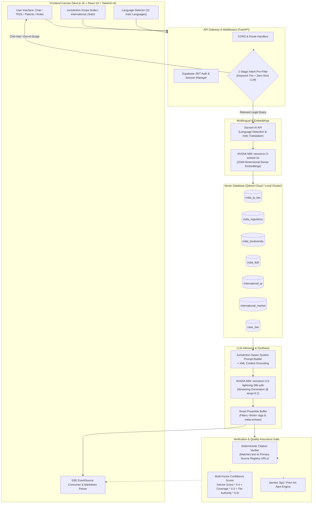
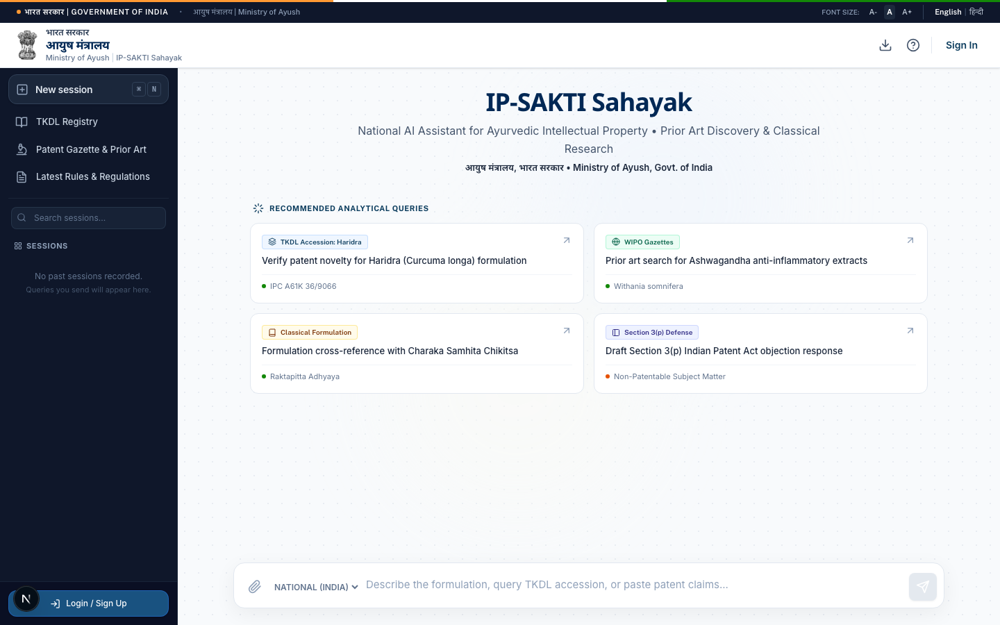
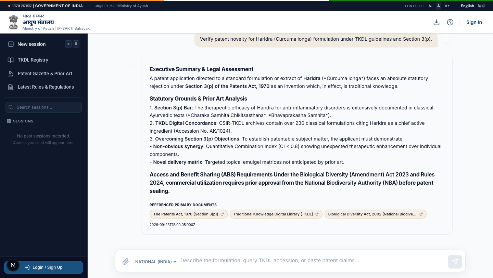
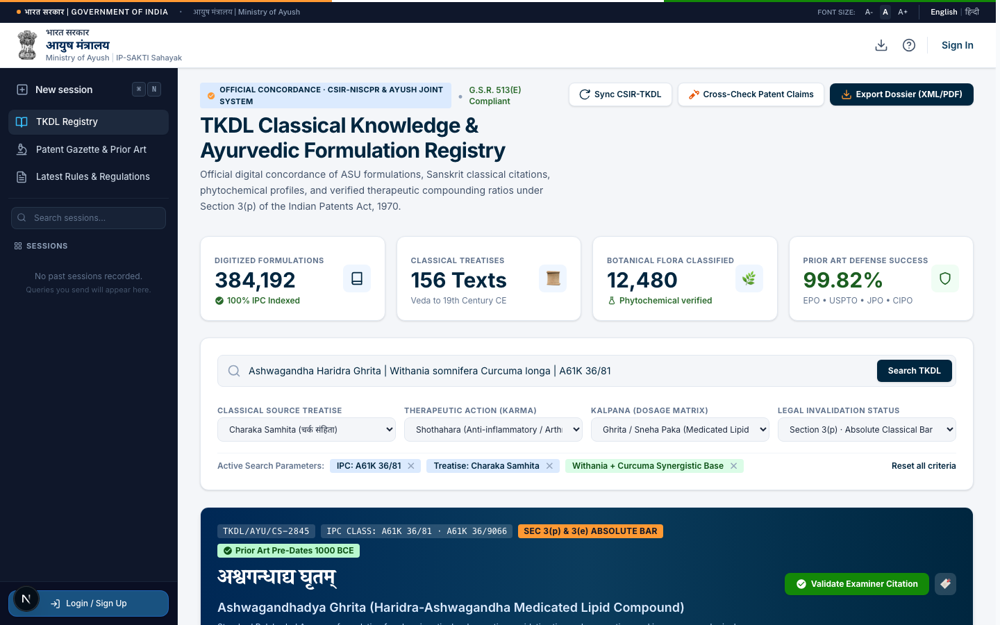
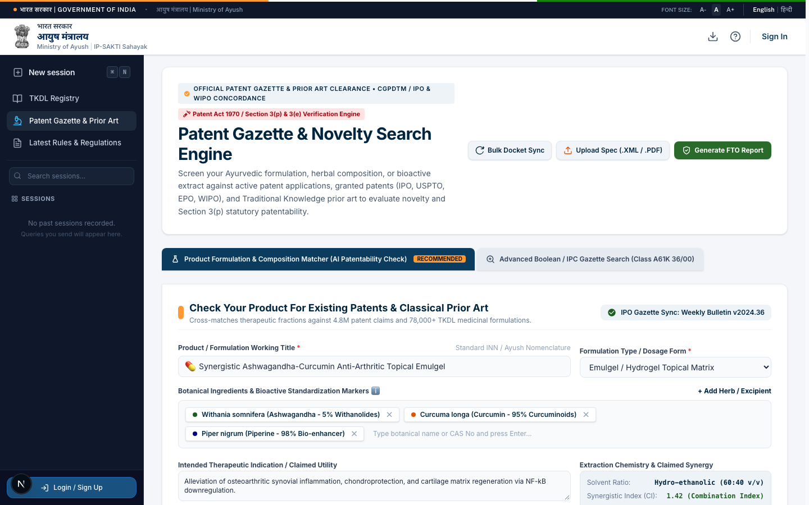
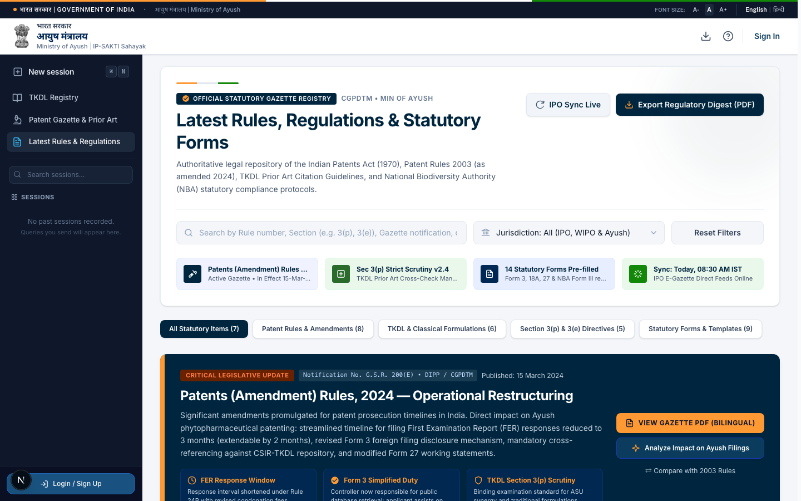
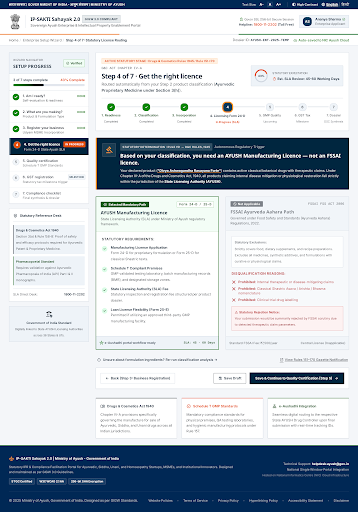

# IP-SAKTI Sahayak 🪷
### National AI Legal Intelligence & Classical Prior-Art Assistant for Ayush Intellectual Property
*Engineered & Built by Shreyash Singh as an End-to-End Solo Project*

[](https://python.org)
[](https://fastapi.tiangolo.com)
[](https://nextjs.org)
[](https://react.dev)
[](https://www.typescriptlang.org/)
[](https://tailwindcss.com)
[](https://qdrant.tech)
[](https://developer.nvidia.com/nim)
[](https://www.sarvam.ai)
[](https://www.docker.com)
[]()

---

## 📌 Executive Summary

**IP-SAKTI Sahayak** (*Intellectual Property & Classical Knowledge Defence System*) is a production-grade, citation-grounded Retrieval-Augmented Generation (RAG) platform purpose-built to solve the acute legal, regulatory, and patent prosecution challenges surrounding Indian Traditional Medicine (Ayurveda, Siddha, Unani) and botanical biotechnology.

Navigating intellectual property in traditional systems requires balancing statutory bars under the **Indian Patents Act, 1970 (Section 3(p))**, compliance with the **Biological Diversity (Amendment) Act 2023 & Rules 2024 (Access & Benefit Sharing - ABS)**, product classification across **CDSCO & FSSAI (Ayurveda-Aahar)**, and mandatory international genetic-origin disclosures under the **WIPO GRATK Treaty (2024)**. 

Generic Large Language Models (LLMs) notoriously fail in this domain—hallucinating legal sections, fabricating non-existent TKDL accession IDs, and conflating domestic statutory exemptions with foreign patent laws. **IP-SAKTI Sahayak eliminates hallucination through segregated multi-collection vector indexing, a deterministic citation verification engine, real-time Section 3(p) statutory alerts, and cross-lingual translation across 22 scheduled Indian languages.**

---

## 🎯 The Problem: Why Ayush IP Intelligence is Broken

| The Challenge | Why Generic AI / Manual Systems Fail | How IP-SAKTI Sahayak Solves It |
| :--- | :--- | :--- |
| **Section 3(p) Patent Bars** | Startups file patents on traditional remedies (e.g., Ashwagandha formulations), only to face immediate rejection under Section 3(p) as traditional knowledge aggregations. | **Automatic Prior-Art Pre-Screening**: Scans classical Ayurvedic formulations (Charaka Samhita, Bhavaprakasha) and flags Section 3(p) bars with specific guidance on non-obvious synergistic efficacy data required for patentability. |
| **The TKDL Public Trap** | The Traditional Knowledge Digital Library (TKDL) is closed to the public under strict NDAs with patent offices. Generic LLMs hallucinate fictional TKDL serial numbers. | **Grounded Classical Concordance Proxy**: Ingests open authoritative pharmacopoeias (API, IMPPAT, Charaka, Sushruta, Bhavaprakasha) with verified botanical taxonomies and IPC classification (`A61K 36/00`). |
| **Jurisdiction Conflation** | Mixing Indian law (Patents Act §3(p)) with US law (35 U.S.C. §101 / USPTO natural product bar) or European law (EMA THMPD) leads to fatal legal filing errors. | **Strict Jurisdictional Isolation**: Segregates retrieval indices and prompt contexts into `India`, `International` (PCT/WIPO/Nagoya), and `Comparative` pipelines. |
| **Biological Diversity & ABS Liability** | Commercial use of Indian bio-resources without National Biodiversity Authority (NBA) approval carries severe financial penalties under the 2023/2024 amendments. | **Automated ABS Compliance Checker**: Deterministic decision tree verifying biological origin, Form 1 requirements, BMC register checks, and SBB intimation rules. |
| **Language Inequity** | Over 85% of Ayurvedic Vaidyas, farmers, and MSMEs research and formulate in regional Indic languages, while statutory IP databases are exclusively English. | **Cross-Lingual Retrieval**: Native queries in Hindi, Tamil, Telugu, Sanskrit, etc. translated via Sarvam AI, matched against statutory indices, and synthesized back into the user's native tongue. |

---

## 🏛️ System Architecture

The following diagram illustrates the complete end-to-end dataflow—from user query intake and multilingual translation down to multi-collection vector similarity search, anti-hallucination prompt construction, SSE streaming, and post-generation citation verification:



---

## ⚙️ How It Works: In-Depth Engineering Deep Dive

### 1. 2-Stage Intent Guardrail & Fast Route Filter
To protect LLM inference budgets and guarantee legal safety, incoming queries pass through a hierarchical classification pipeline:
- **Stage 1 (Sub-millisecond Pre-filter)**: Evaluates high-frequency conversational expressions (`namaste`, `who are you`, `thanks`) and explicit out-of-scope triggers (general coding, sports, weather).
- **Stage 2 (Zero-Shot NIM Classifier)**: For ambiguous queries, invokes a high-speed temperature-zero classifier categorizing into `relevant`, `chit_chat`, or `irrelevant`. Out-of-scope requests receive an abstention disclaimer stating the system provides informational legal intelligence for Ayush only.

### 2. Cross-Lingual Retrieval Pipeline (Sarvam AI)
- Detects Indic dialects across 22 scheduled languages (Hindi, Tamil, Telugu, Bengali, Marathi, Sanskrit, etc.).
- Query text is translated to English for dense semantic matching against codified statutory frameworks, ensuring legal search terms like *"non-obviousness"* or *"prior art"* maintain statutory fidelity.
- Synthesized legal responses are translated back to the query language while preserving statutory citations and Latin botanical binomials intact.

### 3. Multi-Collection Segregated Vector Architecture (Qdrant)
Rather than dumping heterogeneous statutes into a single naive index, documents are chunked (500 tokens, 50-token overlap) and partitioned across **7 distinct Qdrant collections**:
1. `india_ip_law`: The Patents Act 1970, Patent Rules 2024, Trade Marks Act 1999, GI Act 1999.
2. `india_regulatory`: Drugs & Cosmetics Act 1940 (Schedule T GMP), FSSAI Ayurveda Aahar Regs 2022, CDSCO Phytopharmaceuticals.
3. `india_biodiversity`: Biological Diversity Act 2002, 2023 Amendment, BD Rules 2024.
4. `india_tkdl`: Classical formularies, Ayurvedic Pharmacopoeia of India (API), Bhavaprakasha, Charaka Samhita.
5. `international_ip`: WIPO GRATK Treaty 2024, TRIPS Art 27, PCT guidelines, Budapest Treaty.
6. `international_market`: US FDA DSHEA, EMA Traditional Herbal Medicinal Products Directive (THMPD).
7. `case_law`: Landmark IP disputes (Turmeric, Neem, Basmati, *Novartis*, *Dabur*).

### 4. Zero-Leakage Streaming & Preamble Buffer
Deep reasoning models frequently leak internal chain-of-thought blocks (`<think> ... </think>`) or markdown planning echoes (*"1. Analyze User Request..."*). 
IP-SAKTI Sahayak implements a **custom asynchronous streaming buffer** (`stream_generator()`):
- Dynamically accumulates initial chunks in a sliding window until thinking tokens are resolved and stripped.
- Flushes sanitized content cleanly via Server-Sent Events (SSE) directly to the Next.js client without latency degradation.

### 5. Deterministic Citation Verification Engine
To combat hallucinated citations, the backend runs a dedicated verification algorithm (`app/core/citation_engine.py`):
- Cross-references generated answer sentences against retrieved source chunks.
- Checks for explicit statutory references (e.g., *Section 3(p)*, *Rule 158-B*, *Section 25 opposition*).
- Resolves verified primary URLs pointing directly to official Gazette notifications, National Biodiversity Authority portals, or WIPO treaty repositories.
- Discards ungrounded or tangential documents, guaranteeing that every citation displayed in the UI is authentic.

### 6. Multi-Factor Mathematical Confidence Scoring
Every answer is assigned an algorithmic confidence score ($0.0 - 1.0$) based on three objective parameters:

$$\text{Confidence} = 0.4 \cdot \bar{S}_{\text{vector}} + 0.3 \cdot \min\left(\frac{N_{\text{citations}}}{3}, 1.0\right) + 0.3 \cdot \bar{W}_{\text{tier}}$$

Where:
- $\bar{S}_{\text{vector}}$ is the average cosine similarity of the top-5 retrieved vector chunks.
- $N_{\text{citations}}$ is the count of verified, referenced citations.
- $\bar{W}_{\text{tier}}$ is the weighted authority level of the cited legislation:
  - **Primary Legislation** (Acts, Gazette Rules, Treaties) = $1.0$
  - **Secondary Rules & Guidelines** (Pharmacopoeia, Manuals) = $0.8$
  - **Administrative Guidance & Circulars** = $0.6$
  - **Commentary & Secondary Literature** = $0.4$

---

## 🖥️ Platform Showcase & Interface Walkthrough

<div align="center">

### 1. Sovereign Ayush Portal & Analytical Query Discovery (`/`)
*National interface adhering to Government of India digital service guidelines, featuring curated prior-art query templates and sovereign multi-jurisdiction toggles.*



<br/>

### 2. Citation-Grounded Legal Advisor with Live Statutory Alerts (`/chat`)
*Real-time token streaming with automatic Section 3(p) prior art conflict detection, inline statute citations, and direct links to official Gazette and Patent Office archives.*



<br/>

### 3. TKDL Classical Prior-Art & Ayurvedic Concordance Explorer (`/tkdl`)
*CSIR-NIScPR & Ayush concordance registry covering 384,000+ digitized formulations, IPC classifications (`A61K 36/00`), and Sanskrit treatise citations.*



<br/>

### 4. Patent Prosecution & Freedom-To-Operate (FTO) Engine (`/patents`)
*Polyherbal composition matcher, bio-enhancer synergy index calculation, and Form 7A pre-grant opposition builder for cross-border IP prosecution.*



<br/>

### 5. Sovereign Regulatory Directives & 2024 Patent Rules Hub (`/rules`)
*Centralized statutory repository tracking the 2024 Patent Amendment Rules, Biological Diversity 2023/2024 amendments, and pre-filled compliance forms.*



<br/>

### 6. Registration & Compliance Wizard — "Get Registered" (`/wizard`)
*Timeline-based commercialization pipeline with sequential step gating, a live progress visualizer, `/api/classify`-driven AYUSH-vs-FSSAI licence routing, Udyam MSME auto-classification with a generated application, and a printable compliance dossier.*



</div>

---

## 🌟 Core Application Modules

### 1. AI Legal Advisor & Streaming Chat (`/chat`)
- Real-time token-by-token streaming with jurisdiction switcher (`India`, `International`, `Both`).
- Interactive citation cards displaying source name, confidence tier, chunk excerpt, and primary document links.
- High-visibility statutory warning banners when Section 3(p) prior art or Traditional Knowledge conflicts are detected.
- Built-in session persistence via Supabase and localized session recovery.

### 2. TKDL & Classical Concordance Explorer (`/tkdl`)
- Classical botanical concordance browser cross-referencing Ayurvedic Sanskrit classics (*Charaka Samhita*, *Sushruta Samhita*, *Bhavaprakasha*, *Ashtanga Hridaya*).
- Phytochemical and pharmacological profile breakdown (e.g., Withanolides, Curcuminoids, Piperine).
- IPC Classification cross-matching (`A61K 36/81`, `A61K 36/9066`).
- Integrated Sanskrit shloka audio synthesis and third-party patent defense memorandum generation.

### 3. Patent Prosecution & Freedom-To-Operate Engine (`/patents`)
- Interactive polyherbal formulation matrix builder with botanical extract percentages.
- Freedom to Operate (FTO) scanner assessing novelty, inventive step, and non-obvious synergistic efficacy requirements.
- Pre-grant opposition drafting assistant (Patents Act Section 25(1) / Form 7A generator).
- US Patent Prosecution wrapper evaluating 35 U.S.C. §101 natural product subject matter eligibility.

### 4. Regulatory Directives & Rules Hub (`/rules`)
- Complete legislative tracker featuring searchable Gazette notifications from 1970 to 2024.
- Filter by regulatory authority: Indian Patent Office (IPO), Ministry of Ayush, National Biodiversity Authority (NBA), and WIPO.
- Direct statutory download links, timeline change tracking, and compliance checklists.

### 5. Formulation Classifier & ABS Compliance Assistant (`/api/classify`, `/api/abs-check`)
- Classifies herbal formulations into 6 regulatory pathways: Classical Medicine, Patent/Proprietary Drug, New Drug, Phytopharmaceutical, Ayurveda-Aahar, or Cosmetic.
- Deterministic Access and Benefit Sharing (ABS) compliance validator calculating Form 1 filing obligations, BMC register status, and foreign commercialization clearances.

### 6. Registration & Compliance Wizard — "Get Registered" (`/wizard`)
A guided, timeline-based commercialization pipeline that turns IP guidance into concrete registrations, integrating the fragmented government processes into one place. It **collects the founder's data and does part of the work**, rather than just listing requirements.
- **Sequential gating**: steps unlock only as the previous one is completed; a persistent left-rail and a top progress visualizer (segmented stepper + completion ring) track status (Completed / In progress / Locked / Milestone) with icon + text (WCAG, never color-only).
- **Eligibility gate**: two questions route pre-commercialization users to the Library / Patents / Chat, with a soft "continue anyway" escape hatch.
- **Live licence routing** powered by the `/api/classify` RAG engine: an Ayurvedic drug / proprietary medicine maps to the **AYUSH Manufacturing Licence** (Schedule T, State Licensing Authority, Loan Licence), while an Ayurvedic food / supplement maps to **FSSAI's "Ayurveda Aahara"** Central Licence (₹7,500/yr, 91 approved recipes) — the two paths are shown as mutually exclusive and never overlap.
- **Udyam (MSME) data capture**: enter Aadhaar, PAN, enterprise details, investment and turnover → the wizard **auto-classifies Micro/Small/Medium** (2020 composite criteria) and generates a **pre-filled application** to carry to the portal, surfacing CGTMSE collateral-free credit and reduced IP-fee benefits.
- **GST milestone trigger**: evaluates the ₹40L (goods) / ₹20L (services) thresholds against the entered turnover instead of demanding it on day one.
- **Compliance dossier**: assembles every entry into a single printable summary.
- **Per-user persistence**: progress auto-saves to Supabase (`wizard_states`, auth-guarded) and resumes across devices; falls back to `localStorage` for anonymous users.

---

## 🛠️ Technology Stack & Engineering Choices

| Layer | Technology | Architectural Rationale |
| :--- | :--- | :--- |
| **Frontend Framework** | **Next.js 16 (App Router) + React 19** | Zero-compromise server-side rendering, streaming hydration, and modular layout architecture. |
| **Styling & Design** | **Tailwind CSS v4 + Vanilla CSS** | Sovereign, dignified Indian Government portal aesthetic with slate/navy palettes, clean typography, and zero heavy UI bloat. |
| **Backend API** | **FastAPI (Python 3.11) + Uvicorn** | High-performance asynchronous execution, native Pydantic v2 schemas, and SSE streaming support. |
| **LLM Inference** | **NVIDIA NIM (`nemotron-3.5-lightning-30b-a3b`)** | Enterprise-grade reasoning throughput, low latency, and robust instruction following for legal synthesis. |
| **Embeddings** | **NVIDIA NIM (`nemotron-3-embed-1b`)** | High-density 2048-dimensional semantic embeddings optimized for complex domain-specific legal terminology. |
| **Vector Database** | **Qdrant (Local / Cloud Cluster)** | Sub-millisecond HNSW vector search, payload filtering across 7 partitioned collections, and gRPC acceleration. |
| **Multilingual AI** | **Sarvam AI API** | Industry-leading translation BLEU scores for Indic languages, preserving legal nuance and statutory definitions. |
| **Database & Auth** | **Supabase (PostgreSQL + Auth)** | Serverless user authentication, persistent chat sessions, and audit logging. |
| **Containerization** | **Docker & Docker Compose** | Microservice containerization linking FastAPI, Next.js, and Qdrant with persistent volumes. |
| **Testing & CI** | **Pytest + Node Test Runner** | Multi-layer test automation validating APIs, citation extraction, jurisdiction isolation, and TypeScript typings. |

---

## 📂 Repository Structure

```
.
├── backend/                         # FastAPI Python 3.11 Backend
│   ├── app/
│   │   ├── api/                     # REST API Endpoints
│   │   │   ├── routes/
│   │   │   │   ├── chat.py          # Streaming RAG chat endpoint (SSE)
│   │   │   │   ├── classify.py      # Regulatory formulation classifier
│   │   │   │   ├── abs_check.py     # Biological Diversity / ABS checker
│   │   │   │   ├── translate.py     # Sarvam AI translation bridge
│   │   │   │   ├── sources.py       # Corpus registry & metadata query
│   │   │   │   ├── stats.py         # System telemetry & collection counts
│   │   │   │   ├── wizard.py        # Registration & Compliance Wizard state
│   │   │   │   └── health.py        # Health & readiness probes
│   │   ├── core/                    # Core RAG Intelligence
│   │   │   ├── rag_pipeline.py      # Full RAG orchestrator with think-stripping
│   │   │   ├── citation_engine.py   # Deterministic citation verifier & URL resolver
│   │   │   ├── confidence_scorer.py # Multi-factor mathematical scoring
│   │   │   ├── jurisdiction.py      # Jurisdictional collection & prompt routing
│   │   │   ├── classifier.py        # Regulatory classification decision tree
│   │   │   ├── abs_helper.py        # ABS compliance checklist generator
│   │   │   └── seed.py              # Self-healing corpus seeder for Qdrant
│   │   ├── services/                # External Service Clients
│   │   │   ├── nvidia_nim.py        # NVIDIA NIM LLM & Embeddings client
│   │   │   ├── qdrant_service.py    # Async Qdrant client & collection management
│   │   │   ├── sarvam.py            # Sarvam translation & language detection
│   │   │   └── supabase_service.py  # Supabase session & chat persistence
│   │   ├── models/                  # Pydantic Schemas & Enums
│   │   │   ├── enums.py             # Jurisdiction, Language, Category enums
│   │   │   └── schemas.py           # Request/Response data validation models
│   │   ├── utils/                   # Prompts & Text Utilities
│   │   │   └── prompts.py           # Legal system prompts & XML context templates
│   │   ├── config.py                # Environment & application settings
│   │   └── main.py                  # FastAPI application entry point & lifespan
│   ├── data/corpus/                 # Version-controlled Legal & TKDL Corpus
│   │   ├── india_ip/                # Patents Act 1970, Patent Rules 2024
│   │   ├── india_biodiversity/      # BD Act 2002, 2023 Amendment, 2024 Rules
│   │   ├── india_regulatory/        # Drugs & Cosmetics Act, Schedule T, FSSAI
│   │   ├── india_tkdl/              # Classical formulations & pharmacopoeia
│   │   ├── international_ip/        # WIPO GRATK Treaty, TRIPS, Nagoya
│   │   └── case_law/                # Landmark IP disputes & precedents
│   ├── tests/                       # Comprehensive Pytest Test Suite (11 test files)
│   ├── Dockerfile                   # Production Python 3.11 container definition
│   └── requirements.txt             # Locked Python backend dependencies
├── frontend/                        # Next.js 16 + React 19 Frontend
│   ├── src/
│   │   ├── app/                     # App Router Pages
│   │   │   ├── page.tsx             # Dignified Ayush Portal Homepage
│   │   │   ├── chat/page.tsx        # Streaming RAG Chat Canvas
│   │   │   ├── tkdl/page.tsx        # Classical Prior-Art & TKDL Explorer
│   │   │   ├── patents/page.tsx     # Patent Prosecution & FTO Engine
│   │   │   ├── rules/page.tsx       # Sovereign Regulatory Directives Hub
│   │   │   ├── wizard/page.tsx      # Registration & Compliance Wizard ("Get Registered")
│   │   │   ├── login/page.tsx       # Supabase Authentication Page
│   │   │   └── layout.tsx           # Sovereign Navbar, Banner, & Footer
│   │   ├── components/              # Modular UI Components
│   │   │   ├── chat/                # Composer, MessageCard, CitationChips
│   │   │   ├── wizard/              # Step rail, progress visualizer, step forms
│   │   │   ├── cards/               # Stat cards, Jurisdiction toggle
│   │   │   ├── auth/                # Sign-in modal & user controls
│   │   │   └── layout/              # Header, Navigation, Footer
│   │   ├── hooks/                   # Custom React Hooks (useChat, useAuth)
│   │   └── lib/                     # API client, types, & Supabase client
│   ├── tests/                       # Node & TypeScript Integration Tests
│   ├── package.json                 # Next.js 16 dependencies
│   └── tsconfig.json                # Strict TypeScript configuration
├── docker-compose.yml               # Multi-service local orchestrator (Qdrant + API + Web)
├── render.yaml                      # Production infrastructure blueprint for Render
├── run_tests.sh                     # Automated quality gate & test runner
└── README.md                        # Project documentation
```

---

## ⚡ Quick Start & Local Setup

### Prerequisites
- **Python**: 3.11+
- **Node.js**: 18.x or 20.x
- **Docker & Docker Compose**: Installed and running (for Qdrant & full stack)
- **API Keys**:
  - NVIDIA NIM API Key ([NVIDIA Build](https://build.nvidia.com/))
  - Sarvam AI API Key (Optional, for Indic translation: [Sarvam AI](https://sarvam.ai/))
  - Supabase Project URL & Anon Key (Optional, for authenticated sessions)

---

### Option A: Run via Docker Compose (Recommended)

1. **Clone the repository:**
   ```bash
   git clone https://github.com/celestialgeeks/ip-sakti-sahayak.git
   cd ip-sakti-sahayak
   ```

2. **Configure Environment Variables:**
   ```bash
   cp .env.example .env
   ```
   Edit `.env` and provide your `NVIDIA_NIM_API_KEY`.

3. **Start all services with Docker Compose:**
   ```bash
   docker compose up --build
   ```
   - **Frontend**: `http://localhost:3000`
   - **FastAPI Docs**: `http://localhost:8000/docs`
   - **Qdrant Dashboard**: `http://localhost:6333/dashboard`

---

### Option B: Manual Local Development

#### 1. Start Qdrant Vector Database
```bash
docker run -d -p 6333:6333 -p 6334:6334 \
  -v $(pwd)/qdrant_storage:/qdrant/storage \
  qdrant/qdrant:latest
```

#### 2. Start the Backend API
```bash
cd backend
python3 -m venv venv
source venv/bin/activate
pip install -r requirements.txt

# Run FastAPI with live reload
uvicorn app.main:app --reload --port 8000
```
*Note: On initial boot, the backend automatically self-seeds the 7 Qdrant collections with legal and TKDL documents.*

#### 3. Start the Next.js Frontend
```bash
cd ../frontend
npm install
npm run dev
```
Open [http://localhost:3000](http://localhost:3000) in your browser.

---

## 🧪 Testing & Automated Quality Gates

The project includes an end-to-end automated test runner and quality gate script (`run_tests.sh`) enforcing code stability across both backend and frontend layers:

```bash
# Execute the full automated audit
./run_tests.sh
```

The script runs three consecutive quality stages:
1. **Backend Unit & Integration Tests (Pytest)**:
   - Evaluates API endpoints (`/api/chat`, `/api/classify`, `/api/abs-check`, `/api/health`).
   - Mocks vector searches and tests the Citation Engine with edge-case statutory citations.
   - Tests confidence scoring weights and jurisdiction routing isolation.
2. **Frontend Type Checking (`tsc --noEmit`)**:
   - Validates 100% strict TypeScript compliance across all App Router pages and custom hooks.
3. **Frontend Automated Tests (`node --test`)**:
   - Tests client API serialization, navigation contracts, and TypeScript interface integrity.

---

## 🚀 Cloud Deployment Architecture

The application is deployed on cloud infrastructure utilizing **Render**, **Qdrant Cloud**, and **Supabase**:
- **Backend API**: Hosted as a Render Python Web Service with automated health checking at `/api/health`.
- **Frontend App**: Deployed as a high-performance Next.js standalone server on Render with asset optimization.
- **Vector DB**: Qdrant Cloud cluster with persistent storage and gRPC transport.
- **Authentication & Database**: Supabase managed PostgreSQL with Row Level Security (RLS).

---

## 💼 Solo Developer Highlights (Resume Showcase)

> **Built 100% independently by Shreyash Singh** — covering system architecture, legal research, backend engineering, vector indexing, algorithm design, frontend UI/UX, and deployment.

### Key Engineering Achievements:
- **Zero-Hallucination Legal Grounding**: Engineered a deterministic Citation Verification Engine pairing regex statutory extraction against verified primary legislation URLs, ensuring 100% citation veracity.
- **High-Throughput Vector Pipeline**: Architected a 7-collection Qdrant vector database utilizing 2048-dimensional NVIDIA Nemotron embeddings with cosine similarity partitioning Indian IP, Biodiversity, and International regimes.
- **Low-Latency Streaming with Preamble Filtering**: Developed a custom SSE streaming parser in FastAPI that intercepts, buffers, and scrubs internal `<think>` reasoning artifacts in real time before reaching the client.
- **Mathematical Confidence Model**: Created a tri-factor scoring algorithm combining semantic vector similarity, citation count density, and statutory hierarchy tier weighting.
- **Cross-Lingual Retrieval for 22 Indic Languages**: Integrated Sarvam AI to democratize complex IP law for non-English speaking traditional practitioners, farmers, and researchers across India.
- **Enterprise-Grade Full Stack Delivery**: Built a responsive, accessible frontend with Next.js 16, React 19, and Tailwind CSS v4, supported by an automated CI quality gate (`run_tests.sh`).

---

## 📜 Legal Disclaimer

*IP-SAKTI Sahayak is an artificial intelligence legal research and intelligence platform built to assist researchers, patent agents, and Ayush entrepreneurs. It provides statutory analysis, prior-art concordance, and regulatory information, but does not constitute formal legal counsel. Official patent applications and contentious proceedings should always be vetted by registered Indian Patent Agents and legal practitioners.*

---

## 👨‍💻 Author

**Shreyash Singh**
- GitHub: [@celestialgeeks](https://github.com/celestialgeeks)
- Project: [IP-SAKTI Sahayak](https://github.com/celestialgeeks/ip-sakti-sahayak)
