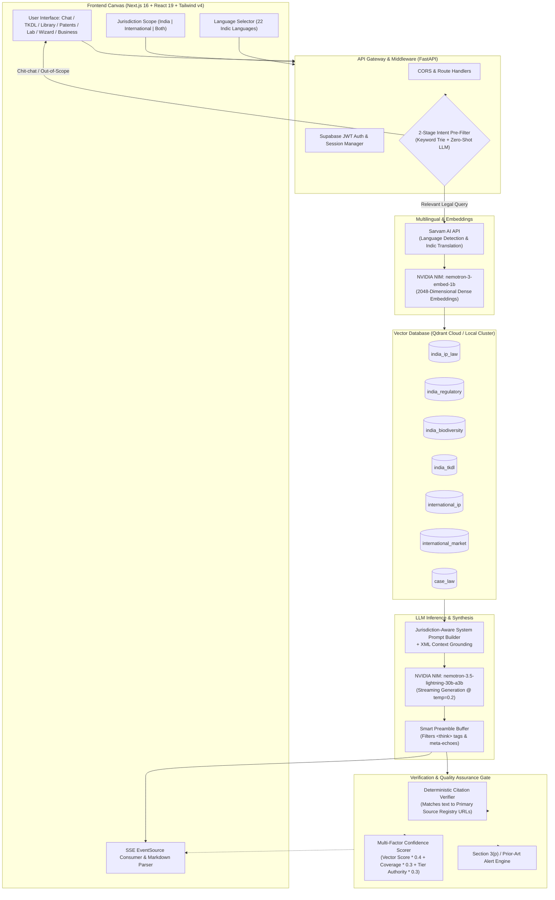
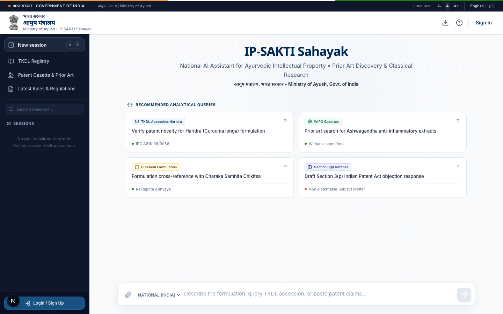
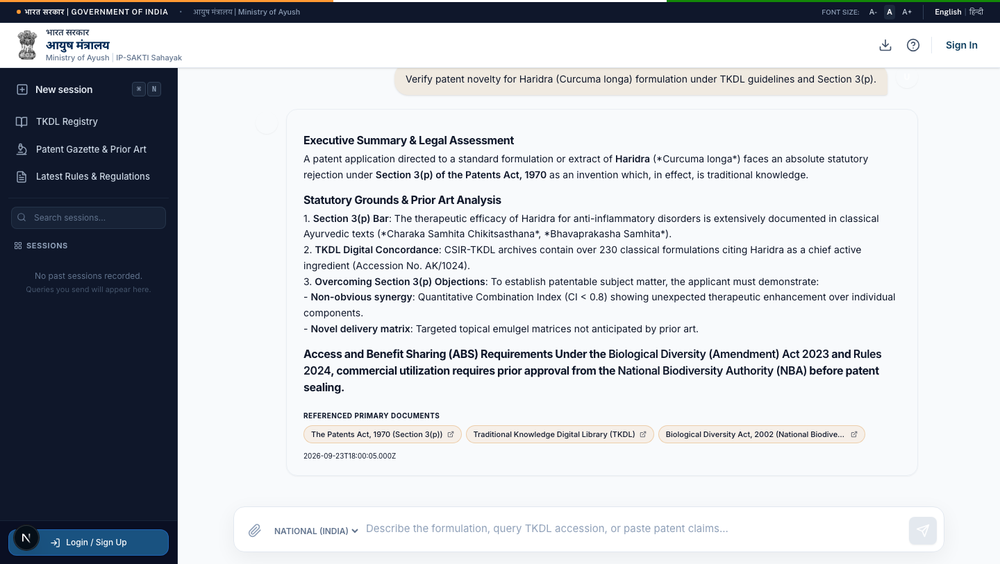
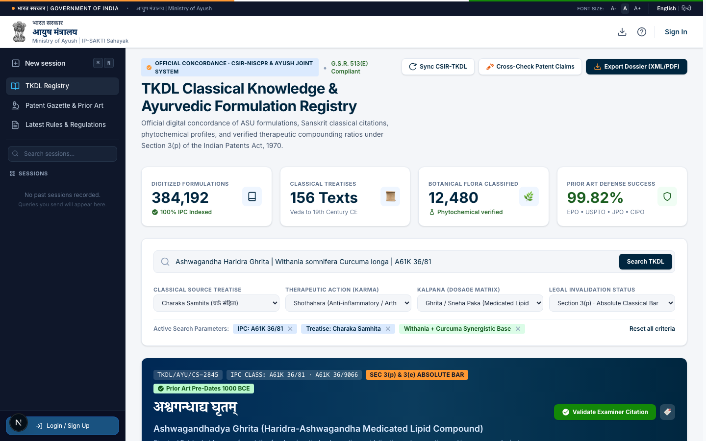
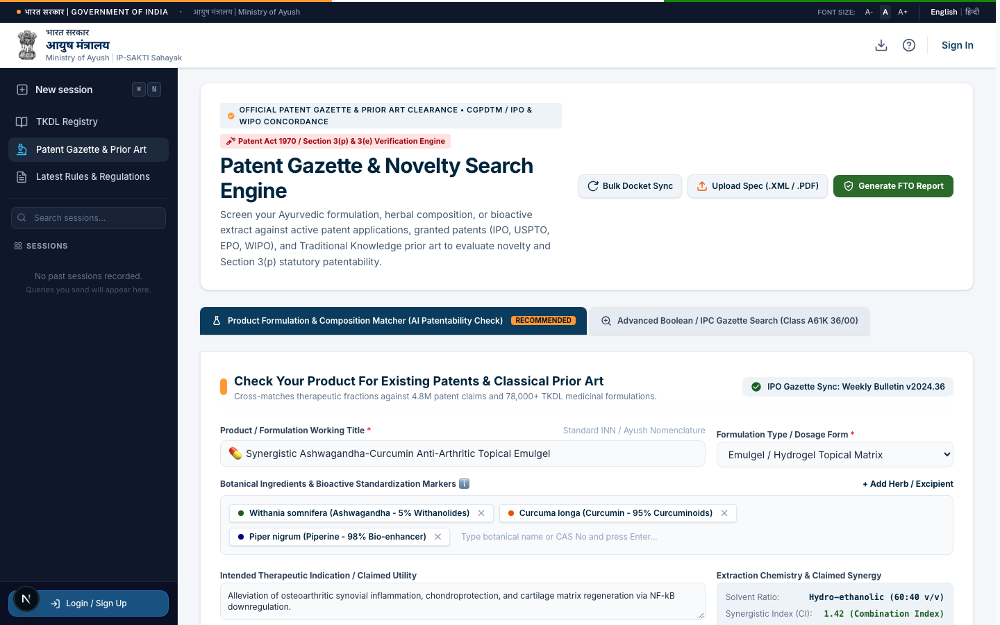
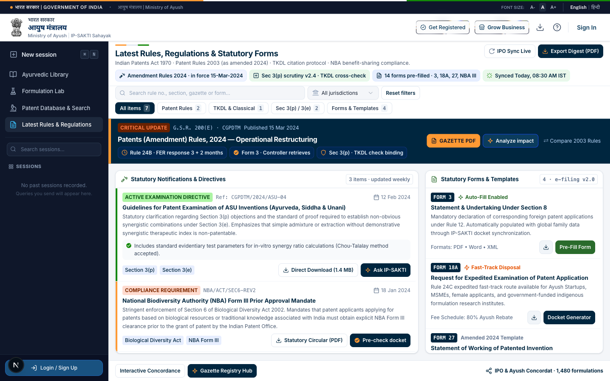
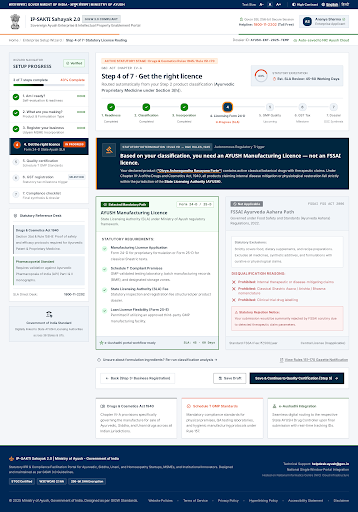
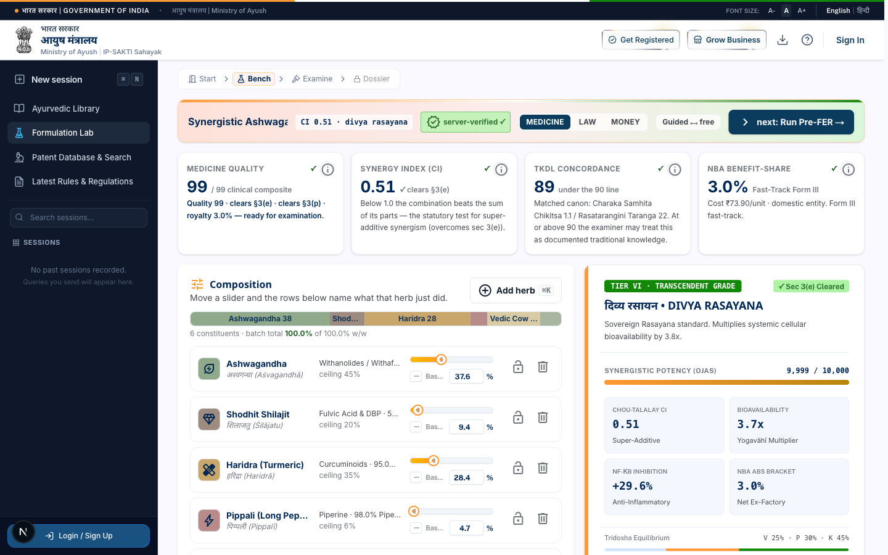
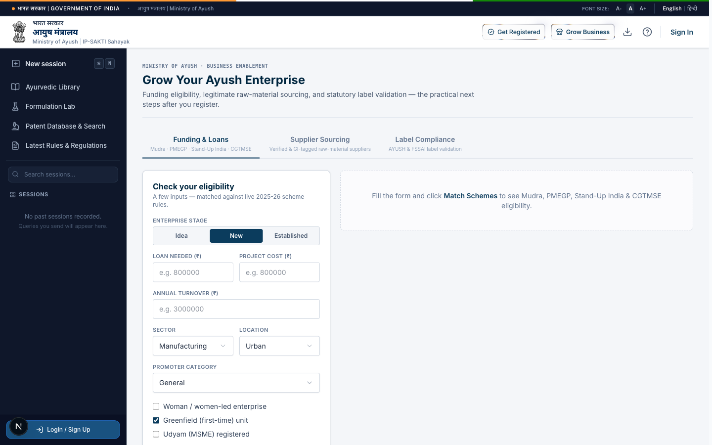
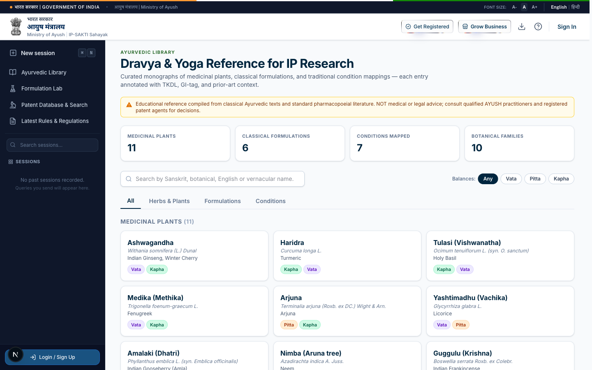

# IP-SAKTI Sahayak 🪷
### National AI Legal Intelligence & Classical Prior-Art Assistant for Ayush Intellectual Property
*Engineered & Built by Shreyash Singh as an End-to-End Solo Project*

[](https://python.org)
[](https://fastapi.tiangolo.com)
[](https://nextjs.org)
[](https://react.dev)
[](https://www.typescriptlang.org/)
[](https://tailwindcss.com)
[](https://qdrant.tech)
[](https://developer.nvidia.com/nim)
[](https://www.sarvam.ai)
[](https://www.docker.com)
[]()

---

## 📌 Executive Summary

**IP-SAKTI Sahayak** (*Intellectual Property & Classical Knowledge Defence System*) is a production-grade, citation-grounded Retrieval-Augmented Generation (RAG) platform purpose-built to solve the acute legal, regulatory, and patent prosecution challenges surrounding Indian Traditional Medicine (Ayurveda, Siddha, Unani) and botanical biotechnology.

Navigating intellectual property in traditional systems requires balancing statutory bars under the **Indian Patents Act, 1970 (Section 3(p))**, compliance with the **Biological Diversity (Amendment) Act 2023 & Rules 2024 (Access & Benefit Sharing - ABS)**, product classification across **CDSCO & FSSAI (Ayurveda-Aahar)**, and mandatory international genetic-origin disclosures under the **WIPO GRATK Treaty (2024)**. 

Generic Large Language Models (LLMs) notoriously fail in this domain—hallucinating legal sections, fabricating non-existent TKDL accession IDs, and conflating domestic statutory exemptions with foreign patent laws. **IP-SAKTI Sahayak eliminates hallucination through segregated multi-collection vector indexing, a deterministic citation verification engine, real-time Section 3(p) statutory alerts, and cross-lingual translation across 22 scheduled Indian languages.**

Beyond research, the platform now carries an Ayush founder across the **entire commercialisation arc**: prior-art and statutory intelligence → a deterministic **Formulation Lab** that simulates medicine quality, §3(e)/§3(p) patentability and NBA royalty per ingredient → a guided **Registration & Compliance Wizard** (Udyam, AYUSH/FSSAI licence, GST) → **Business Enablement** (funding-scheme matching, GI-tagged supplier sourcing, label compliance) — all grounded in a curated, schema-validated **Ayurvedic Library**.

---

## 🎯 The Problem: Why Ayush IP Intelligence is Broken

| The Challenge | Why Generic AI / Manual Systems Fail | How IP-SAKTI Sahayak Solves It |
| :--- | :--- | :--- |
| **Section 3(p) Patent Bars** | Startups file patents on traditional remedies (e.g., Ashwagandha formulations), only to face immediate rejection under Section 3(p) as traditional knowledge aggregations. | **Automatic Prior-Art Pre-Screening**: Scans classical Ayurvedic formulations (Charaka Samhita, Bhavaprakasha) and flags Section 3(p) bars with specific guidance on non-obvious synergistic efficacy data required for patentability. |
| **The TKDL Public Trap** | The Traditional Knowledge Digital Library (TKDL) is closed to the public under strict NDAs with patent offices. Generic LLMs hallucinate fictional TKDL serial numbers. | **Grounded Classical Concordance Proxy**: Ingests open authoritative pharmacopoeias (API, IMPPAT, Charaka, Sushruta, Bhavaprakasha) with verified botanical taxonomies and IPC classification (`A61K 36/00`). |
| **Jurisdiction Conflation** | Mixing Indian law (Patents Act §3(p)) with US law (35 U.S.C. §101 / USPTO natural product bar) or European law (EMA THMPD) leads to fatal legal filing errors. | **Strict Jurisdictional Isolation**: Segregates retrieval indices and prompt contexts into `India`, `International` (PCT/WIPO/Nagoya), and `Comparative` pipelines. |
| **Biological Diversity & ABS Liability** | Commercial use of Indian bio-resources without National Biodiversity Authority (NBA) approval carries severe financial penalties under the 2023/2024 amendments. | **Automated ABS Compliance Checker**: Deterministic decision tree verifying biological origin, Form 1 requirements, BMC register checks, and SBB intimation rules. |
| **Language Inequity** | Over 85% of Ayurvedic Vaidyas, farmers, and MSMEs research and formulate in regional Indic languages, while statutory IP databases are exclusively English. | **Cross-Lingual Retrieval**: Native queries in Hindi, Tamil, Telugu, Sanskrit, etc. translated via Sarvam AI, matched against statutory indices, and synthesized back into the user's native tongue. |
| **Blind Formulation & Registration Fog** | Formulators tune ratios on intuition with no view of how quality, patentability and ABS royalty interact; registration then stalls across fragmented Udyam/licence/GST portals, and funding/label rules stay undiscovered until penalties arrive. | **Formulation Lab + Wizard + Business Enablement**: a deterministic simulation engine with per-ingredient attribution and a §3(e)/§3(p) gate ladder, a sequentially-gated compliance wizard that pre-fills actual applications, and LLM-free funding, supplier and label validators citing primary sources. |

---

## 🏛️ System Architecture

The following diagram illustrates the complete end-to-end dataflow—from user query intake and multilingual translation down to multi-collection vector similarity search, anti-hallucination prompt construction, SSE streaming, and post-generation citation verification:


```mermaid
flowchart TD
    subgraph Client["Frontend Canvas (Next.js 16 + React 19 + Tailwind v4)"]
        UI["User Interface: Chat / TKDL / Library / Patents / Lab / Wizard / Business"]
        LangSel["Language Selector (22 Indic Languages)"]
        JurToggle["Jurisdiction Scope (India | International | Both)"]
        StreamConsumer["SSE EventSource Consumer & Markdown Parser"]
    end

    subgraph Gateway["API Gateway & Middleware (FastAPI)"]
        CORS["CORS & Route Handlers"]
        Auth["Supabase JWT Auth & Session Manager"]
        PreFilter{"2-Stage Intent Pre-Filter<br/>(Keyword Trie + Zero-Shot LLM)"}
    end

    subgraph NLP["Multilingual & Embeddings"]
        Sarvam["Sarvam AI API<br/>(Language Detection & Indic Translation)"]
        Embedder["NVIDIA NIM: nemotron-3-embed-1b<br/>(2048-Dimensional Dense Embeddings)"]
    end

    subgraph Storage["Vector Database (Qdrant Cloud / Local Cluster)"]
        Col1[("india_ip_law")]
        Col2[("india_regulatory")]
        Col3[("india_biodiversity")]
        Col4[("india_tkdl")]
        Col5[("international_ip")]
        Col6[("international_market")]
        Col7[("case_law")]
    end

    subgraph LLMEngine["LLM Inference & Synthesis"]
        PromptBuilder["Jurisdiction-Aware System Prompt Builder<br/>+ XML Context Grounding"]
        LLM["NVIDIA NIM: nemotron-3.5-lightning-30b-a3b<br/>(Streaming Generation @ temp=0.2)"]
        PreambleFilter["Smart Preamble Buffer<br/>(Filters &lt;think&gt; tags & meta-echoes)"]
    end

    subgraph PostProcessor["Verification & Quality Assurance Gate"]
        CitationEngine["Deterministic Citation Verifier<br/>(Matches text to Primary Source Registry URLs)"]
        Scorer["Multi-Factor Confidence Scorer<br/>(Vector Score * 0.4 + Coverage * 0.3 + Tier Authority * 0.3)"]
        StatutoryDetector["Section 3(p) / Prior-Art Alert Engine"]
    end

    UI --> Gateway
    JurToggle --> Gateway
    LangSel --> Gateway
    Gateway --> PreFilter
    PreFilter -- "Chit-chat / Out-of-Scope" --> UI
    PreFilter -- "Relevant Legal Query" --> Sarvam
    Sarvam --> Embedder
    Embedder --> Storage
    Storage --> PromptBuilder
    PromptBuilder --> LLM
    LLM --> PreambleFilter
    PreambleFilter --> StreamConsumer
    PreambleFilter --> PostProcessor
    PostProcessor --> CitationEngine
    PostProcessor --> Scorer
    PostProcessor --> StatutoryDetector
    PostProcessor -.-> StreamConsumer
```

---

## ⚙️ How It Works: In-Depth Engineering Deep Dive

### 1. 2-Stage Intent Guardrail & Fast Route Filter
To protect LLM inference budgets and guarantee legal safety, incoming queries pass through a hierarchical classification pipeline:
- **Stage 1 (Sub-millisecond Pre-filter)**: Evaluates high-frequency conversational expressions (`namaste`, `who are you`, `thanks`) and explicit out-of-scope triggers (general coding, sports, weather).
- **Stage 2 (Zero-Shot NIM Classifier)**: For ambiguous queries, invokes a high-speed temperature-zero classifier categorizing into `relevant`, `chit_chat`, or `irrelevant`. Out-of-scope requests receive an abstention disclaimer stating the system provides informational legal intelligence for Ayush only.

### 2. Cross-Lingual Retrieval Pipeline (Sarvam AI)
- Detects Indic dialects across 22 scheduled languages (Hindi, Tamil, Telugu, Bengali, Marathi, Sanskrit, etc.).
- Query text is translated to English for dense semantic matching against codified statutory frameworks, ensuring legal search terms like *"non-obviousness"* or *"prior art"* maintain statutory fidelity.
- Synthesized legal responses are translated back to the query language while preserving statutory citations and Latin botanical binomials intact.

### 3. Multi-Collection Segregated Vector Architecture (Qdrant)
Rather than dumping heterogeneous statutes into a single naive index, documents are chunked (500 tokens, 50-token overlap) and partitioned across **7 distinct Qdrant collections**:
1. `india_ip_law`: The Patents Act 1970, Patent Rules 2024, Trade Marks Act 1999, GI Act 1999.
2. `india_regulatory`: Drugs & Cosmetics Act 1940 (Schedule T GMP), FSSAI Ayurveda Aahar Regs 2022, CDSCO Phytopharmaceuticals.
3. `india_biodiversity`: Biological Diversity Act 2002, 2023 Amendment, BD Rules 2024.
4. `india_tkdl`: Classical formularies, Ayurvedic Pharmacopoeia of India (API), Bhavaprakasha, Charaka Samhita.
5. `international_ip`: WIPO GRATK Treaty 2024, TRIPS Art 27, PCT guidelines, Budapest Treaty.
6. `international_market`: US FDA DSHEA, EMA Traditional Herbal Medicinal Products Directive (THMPD).
7. `case_law`: Landmark IP disputes (Turmeric, Neem, Basmati, *Novartis*, *Dabur*).

### 4. Zero-Leakage Streaming & Preamble Buffer
Deep reasoning models frequently leak internal chain-of-thought blocks (`<think> ... </think>`) or markdown planning echoes (*"1. Analyze User Request..."*). 
IP-SAKTI Sahayak implements a **custom asynchronous streaming buffer** (`stream_generator()`):
- Dynamically accumulates initial chunks in a sliding window until thinking tokens are resolved and stripped.
- Flushes sanitized content cleanly via Server-Sent Events (SSE) directly to the Next.js client without latency degradation.

### 5. Deterministic Citation Verification Engine
To combat hallucinated citations, the backend runs a dedicated verification algorithm (`app/core/citation_engine.py`):
- Cross-references generated answer sentences against retrieved source chunks.
- Checks for explicit statutory references (e.g., *Section 3(p)*, *Rule 158-B*, *Section 25 opposition*).
- Resolves verified primary URLs pointing directly to official Gazette notifications, National Biodiversity Authority portals, or WIPO treaty repositories.
- Discards ungrounded or tangential documents, guaranteeing that every citation displayed in the UI is authentic.

### 6. Multi-Factor Mathematical Confidence Scoring
Every answer is assigned an algorithmic confidence score ($0.0 - 1.0$) based on three objective parameters:

$$\text{Confidence} = 0.4 \cdot \bar{S}_{\text{vector}} + 0.3 \cdot \min\left(\frac{N_{\text{citations}}}{3}, 1.0\right) + 0.3 \cdot \bar{W}_{\text{tier}}$$

Where:
- $\bar{S}_{\text{vector}}$ is the average cosine similarity of the top-5 retrieved vector chunks.
- $N_{\text{citations}}$ is the count of verified, referenced citations.
- $\bar{W}_{\text{tier}}$ is the weighted authority level of the cited legislation:
  - **Primary Legislation** (Acts, Gazette Rules, Treaties) = $1.0$
  - **Secondary Rules & Guidelines** (Pharmacopoeia, Manuals) = $0.8$
  - **Administrative Guidance & Circulars** = $0.6$
  - **Commentary & Secondary Literature** = $0.4$

### 7. Deterministic Formulation Engine with Cross-Language Parity
The Formulation Lab refuses to fake its numbers. The scoring core (`backend/app/core/formulation/engine.py::score_core`) is **pure** — no I/O, no randomness, no LLM prose — and is mirrored **verbatim in TypeScript** (`frontend/src/lib/formulation/engine.ts`):

- **Two-speed feedback**: the client re-scores instantly on every slider move (live dot), while a debounced 400 ms `POST /api/formulation-lab/simulate` acts as the authority; any server/client mismatch is surfaced in the UI, never silently smoothed over.
- **Engine-parity harness**: a version-controlled fixture (`backend/tests/fixtures/engine_parity.json`) is replayed by *both* the Pytest suite and the Node test runner, so the Python and TypeScript engines are contractually forbidden from drifting apart.
- **Per-ingredient attribution**: contributions are computed by ±1.0% w/w **central-difference perturbation** of the pure core — each herb's marginal effect on quality, Chou-Talalay CI, patentability, royalty and cost is measured, not asserted, with deterministic half-up rounding shared across both engines.
- **One gate ladder**: a single pure function (`gates.ts`) ranks the unmet statutory gates (§3(e) synergism, §3(p) concordance ≥ 90, safety ceilings, 100.0% w/w balance) and drives the adaptive CTA, the verdict line, the guided narration, and the stage trail (doors → bench → examine → dossier) from one source of truth.
- **Honest Pre-FER**: the simulated IPO First Examination Report never fabricates `application_no` or `filing_date` — it is clearly badged as offline/simulated, and a `FATAL` §3(p) objection is remedyable via a directive that jumps back to the bench with the fix staged. The LLM may draft the summary and Form 2 claim text with RAG citations, but **may never move a FATAL/OVERCOME verdict**.
- **Curated catalogs**: 28 botanicals with documented safety ceilings and ED50s, a Sanskrit/vernacular synonym map, and 14 presets with deliberate spread (including a §3(e) failure, a §3(p) trap, ceiling breaches, and cheap-but-weak decoys). Advertised preset chips are *generated* by `scripts/score_presets.py` rather than hand-typed, and CI asserts the spread, the no-locked-ingredients rule, and that each preset's baseline equals its ingredient list.

### 8. LLM-Free Business Enablement Validators
Funding, sourcing and label decisions carry real financial penalties, so the Business Enablement endpoints (`/api/business/*`) are **fully deterministic** — no model in the loop:

- **Funding matcher**: a rule engine over curated 2025-26 scheme catalogs (Mudra / PMEGP / Stand-Up India / CGTMSE) producing ranked eligibility verdicts, including PMEGP special-category (SC/ST/OBC/women) overlays and Udyam-registration unlock gating consistent with the Wizard.
- **Supplier directory**: GI-tagged raw-material suppliers tied back into the ABS/TKDL provenance narrative, with server-side filter/search on state, certification and GI tags.
- **Label validator**: AYUSH (D&C Rule 161 / Schedule E1) and FSSAI label-compliance checks reusing the same cite-against-primary-source discipline as the legal citation engine.
- **Fail-fast integrity**: catalog corruption surfaces as `503 business_catalog_unavailable` rather than silently returning empty results; every response embeds official source citations and a standing disclaimer.

---

## 🖥️ Platform Showcase & Interface Walkthrough

<div align="center">

### 1. Sovereign Ayush Portal & Analytical Query Discovery (`/`)
*National interface adhering to Government of India digital service guidelines, featuring curated prior-art query templates and sovereign multi-jurisdiction toggles.*



<br/>

### 2. Citation-Grounded Legal Advisor with Live Statutory Alerts (`/chat`)
*Real-time token streaming with automatic Section 3(p) prior art conflict detection, inline statute citations, and direct links to official Gazette and Patent Office archives.*



<br/>

### 3. TKDL Classical Prior-Art & Ayurvedic Concordance Explorer (`/tkdl`)
*CSIR-NIScPR & Ayush concordance registry covering 384,000+ digitized formulations, IPC classifications (`A61K 36/00`), and Sanskrit treatise citations.*



<br/>

### 4. Patent Prosecution & Freedom-To-Operate (FTO) Engine (`/patents`)
*Polyherbal composition matcher, bio-enhancer synergy index calculation, and Form 7A pre-grant opposition builder for cross-border IP prosecution.*



<br/>

### 5. Sovereign Regulatory Directives & 2024 Patent Rules Hub (`/rules`)
*Single-screen statutory console — only the directives and forms rails scroll. Tabbed filters with data-derived counts, jurisdiction scoping, a 2024 critical-update banner, and pre-filled compliance forms.*



<br/>

### 6. Registration & Compliance Wizard — "Get Registered" (`/wizard`)
*Timeline-based commercialization pipeline with sequential step gating, a live progress visualizer, `/api/classify`-driven AYUSH-vs-FSSAI licence routing, Udyam MSME auto-classification with a generated application, and a printable compliance dossier.*



<br/>

### 7. Formulation Lab — Assembly Bench (`/formulation-lab`)
*Deterministic simulation engine with per-ingredient contribution rows, two-speed scoring (instant client + server-verified authority), the §3(e)/§3(p) gate ladder driving a single adaptive CTA, and the doors → bench → examine → dossier stage trail.*



<br/>

### 8. Business Enablement Hub — "Grow Business" (`/business`)
*URL-synced tabs for deterministic funding eligibility (Mudra / PMEGP / Stand-Up India / CGTMSE), a GI-tagged raw-material supplier directory, and AYUSH & FSSAI label compliance validation — all LLM-free with embedded primary-source citations.*



<br/>

### 9. Ayurvedic Library — Dravya & Yoga Reference (`/ayurveda`)
*Schema-validated monographs of medicinal plants, classical formulations and condition mappings with accent-insensitive weighted search, dosha balancing filters, cross-entity links, and a standing medical disclaimer; the same store grounds herb Q&A in the RAG pipeline.*



</div>

---

## 🌟 Core Application Modules

### 1. AI Legal Advisor & Streaming Chat (`/chat`)
- Real-time token-by-token streaming with jurisdiction switcher (`India`, `International`, `Both`).
- Interactive citation cards displaying source name, confidence tier, chunk excerpt, and primary document links.
- High-visibility statutory warning banners when Section 3(p) prior art or Traditional Knowledge conflicts are detected.
- Built-in session persistence via Supabase and localized session recovery.

### 2. Ayurvedic Library — Dravya & Yoga Reference (`/ayurveda`)
A curated, schema-validated knowledge store (11 medicinal plants, 6 classical formulations, 7 mapped conditions) built for IP research rather than medical advice:
- Version-controlled JSON catalogs (`backend/data/ayurveda/`) with per-record integrity checks that **fail fast on load**; a CI-checkable validator (`scripts/validate_ayurveda_data.py`) guards the data.
- Weighted, accent-insensitive cross-entity search with pagination, Sanskrit/botanical/vernacular name matching, dosha-balance filters, and cross-links between plants, formulations and conditions.
- `/api/ayurveda/*` endpoints (stats, search, monograph detail pages) with OpenAPI examples and embedded disclaimers; freshness derived from file mtime instead of a hardcoded `updated_at`.
- The same store **grounds herb Q&A inside the RAG pipeline**, surfacing curated monograph context behind every answer.

### 3. TKDL & Classical Concordance Explorer (`/tkdl`)
- Classical botanical concordance browser cross-referencing Ayurvedic Sanskrit classics (*Charaka Samhita*, *Sushruta Samhita*, *Bhavaprakasha*, *Ashtanga Hridaya*).
- Phytochemical and pharmacological profile breakdown (e.g., Withanolides, Curcuminoids, Piperine).
- IPC Classification cross-matching (`A61K 36/81`, `A61K 36/9066`).
- Integrated Sanskrit shloka audio synthesis and third-party patent defense memorandum generation.

### 4. Patent Prosecution & Freedom-To-Operate Engine (`/patents`)
- Interactive polyherbal formulation matrix builder with botanical extract percentages.
- Freedom to Operate (FTO) scanner assessing novelty, inventive step, and non-obvious synergistic efficacy requirements.
- Pre-grant opposition drafting assistant (Patents Act Section 25(1) / Form 7A generator).
- US Patent Prosecution wrapper evaluating 35 U.S.C. §101 natural product subject matter eligibility.

### 5. Formulation Lab — Simulation, Examination & Dossier (`/formulation-lab`)
The engineering deep dive is in §7 above; as a product module it implements the full `formulation-lab-flow-spec.md` flow:
- **Entry doors**: start from a condition, a hero herb, a classical formulation, or a ranked preset — with "Continue recent work" restored from the autosaved scenario store.
- **Assembly bench**: per-ingredient sliders with safety ceilings, stacked composition bar, `⌘K` herb drawer over 28 botanicals, one-level Undo with projected impact, auto-balance to 100.0% w/w, and Medicine/Law/Money reading lenses (order only, never data).
- **Contribution rows**: who did what — each herb's marginal ΔQuality, ΔCI, ΔPatent, ΔRoyalty, ΔCost with an `Apply fix` directive; patient-safety ceiling breaches surfaced as CRITICAL/WARNING.
- **Examine (Pre-FER)**: simulated IPO First Examination Report with FATAL/OVERCOME/ADVISORY objection cards, each looping back to the bench with the remedy staged, plus a recommended Form 2 claim draft.
- **Dossier (Export)**: locked until zero FATAL objections; includes the formulation table, Pre-FER report, safety panel, quadrant trajectory, applied-directive log, ABS/Form III status and citations, with an isolated print stylesheet.
- **Persistence & handoffs**: scenario autosave to SQLite with `?scenario=` round-trips, and a "Licence path →" handoff into the Registration Wizard.

### 6. Regulatory Directives & Rules Hub (`/rules`)
A single-screen statutory console — no page scroll; only the directives and forms rails scroll internally:
- Searchable Gazette notifications and directives (1970 → 2024) with tabbed filters whose counts are derived from the data, and jurisdiction filtering (IPO, Ministry of Ayush, NBA, WIPO).
- Featured "critical update" card with per-rule chips (e.g. Rule 24B FER response window, Form 3 retrieval, §3(p) TKDL check binding) and one-click Gazette PDF / impact analysis / 2003-vs-2024 comparison.
- Pre-filled statutory forms and templates (Form 3, 18A, 27, NBA III) with auto-fill and docket-generator handoffs, plus compliance checklists and an IPO & Ayush concordance strip.

### 7. Formulation Classifier & ABS Compliance Assistant (`/api/classify`, `/api/abs-check`)
- Classifies herbal formulations into 6 regulatory pathways: Classical Medicine, Patent/Proprietary Drug, New Drug, Phytopharmaceutical, Ayurveda-Aahar, or Cosmetic.
- Deterministic Access and Benefit Sharing (ABS) compliance validator calculating Form 1 filing obligations, BMC register status, and foreign commercialization clearances.

### 8. Registration & Compliance Wizard — "Get Registered" (`/wizard`)
A guided, timeline-based commercialization pipeline that turns IP guidance into concrete registrations, integrating the fragmented government processes into one place. It **collects the founder's data and does part of the work**, rather than just listing requirements.
- **Sequential gating**: steps unlock only as the previous one is completed; a persistent left-rail and a top progress visualizer (segmented stepper + completion ring) track status (Completed / In progress / Locked / Milestone) with icon + text (WCAG, never color-only).
- **Eligibility gate**: two questions route pre-commercialization users to the Library / Patents / Chat, with a soft "continue anyway" escape hatch.
- **Live licence routing** powered by the `/api/classify` RAG engine: an Ayurvedic drug / proprietary medicine maps to the **AYUSH Manufacturing Licence** (Schedule T, State Licensing Authority, Loan Licence), while an Ayurvedic food / supplement maps to **FSSAI's "Ayurveda Aahara"** Central Licence (₹7,500/yr, 91 approved recipes) — the two paths are shown as mutually exclusive and never overlap.
- **Udyam (MSME) data capture**: enter Aadhaar, PAN, enterprise details, investment and turnover → the wizard **auto-classifies Micro/Small/Medium** (2020 composite criteria) and generates a **pre-filled application** to carry to the portal, surfacing CGTMSE collateral-free credit and reduced IP-fee benefits.
- **GST milestone trigger**: evaluates the ₹40L (goods) / ₹20L (services) thresholds against the entered turnover instead of demanding it on day one.
- **Compliance dossier**: assembles every entry into a single printable summary.
- **Per-user persistence**: progress auto-saves to Supabase (`wizard_states`, auth-guarded) and resumes across devices; falls back to `localStorage` for anonymous users.

### 9. Business Enablement Suite — "Grow Business" (`/business`)
The post-registration layer, reachable from the header at every stage of the journey:
- **Funding & Loans tab**: enterprise profile (stage, loan need, project cost, turnover, sector, location, promoter category, woman/greenfield/Udyam flags) → ranked Mudra / PMEGP / Stand-Up India / CGTMSE eligibility verdicts with official scheme citations; Udyam registration from the Wizard unlocks scheme tiers.
- **Supplier Sourcing tab**: filterable directory of verified, GI-tagged raw-material suppliers (state, certification, GI-only) wired into the ABS/TKDL provenance story.
- **Label Compliance tab**: AYUSH (D&C Rule 161 / Schedule E1) and FSSAI label validation with per-rule pass/fail and statutory citations.
- URL-synced tabs, full validation, loading/error/retry states, and accessibility-wired forms throughout.

---

## 🛠️ Technology Stack & Engineering Choices

| Layer | Technology | Architectural Rationale |
| :--- | :--- | :--- |
| **Frontend Framework** | **Next.js 16 (App Router) + React 19** | Zero-compromise server-side rendering, streaming hydration, and modular layout architecture. |
| **Styling & Design** | **Tailwind CSS v4 + shadcn/ui (Material 3 tokens)** | Sovereign, dignified Indian Government portal aesthetic with slate/navy palettes, a Material-3 token restyle, and shadcn primitives (breadcrumb, select, etc.) integrated without abandoning the design system. |
| **Backend API** | **FastAPI (Python 3.11) + Uvicorn** | High-performance asynchronous execution, native Pydantic v2 schemas, and SSE streaming support. |
| **LLM Inference** | **NVIDIA NIM (`nemotron-3.5-lightning-30b-a3b`)** | Enterprise-grade reasoning throughput, low latency, and robust instruction following for legal synthesis. |
| **Embeddings** | **NVIDIA NIM (`nemotron-3-embed-1b`)** | High-density 2048-dimensional semantic embeddings optimized for complex domain-specific legal terminology. |
| **Vector Database** | **Qdrant (Local / Cloud Cluster)** | Sub-millisecond HNSW vector search, payload filtering across 7 partitioned collections, and gRPC acceleration. |
| **Multilingual AI** | **Sarvam AI API** | Industry-leading translation BLEU scores for Indic languages, preserving legal nuance and statutory definitions. |
| **Database & Auth** | **Supabase (PostgreSQL + Auth) + SQLite** | Serverless user authentication, persistent chat sessions, wizard-state and audit logging; a local SQLite store (`sessions`, `audit_log`, `feedback`, `formulation_scenarios`) backs scenario autosave and anonymous fallback. |
| **Simulation Engine** | **Deterministic Python + TypeScript mirror** | The formulation scoring core exists twice — `engine.py` (authoritative) and `engine.ts` (instant client scoring) — kept byte-for-byte honest by a shared parity fixture instead of an LLM guessing numbers. |
| **Containerization** | **Docker & Docker Compose** | Compose orchestrates FastAPI + Qdrant with persistent volumes; the Next.js frontend runs via its dev server locally and deploys through Render's node buildpack. |
| **Testing & CI** | **Pytest + Node Test Runner** | Multi-layer test automation validating APIs, citation extraction, jurisdiction isolation, and TypeScript typings. |

---

## 📂 Repository Structure

```
.
├── backend/                         # FastAPI Python 3.11 Backend
│   ├── app/
│   │   ├── api/
│   │   │   ├── middleware/          # Auth, rate limiting, audit log, disclaimer injection
│   │   │   ├── routes/
│   │   │   │   ├── chat.py          # Streaming RAG chat endpoint (SSE)
│   │   │   │   ├── classify.py      # Regulatory formulation classifier
│   │   │   │   ├── abs_check.py     # Biological Diversity / ABS checker
│   │   │   │   ├── formulation_lab.py  # Simulation, Pre-FER, optimize, scenario autosave
│   │   │   │   ├── ayurveda.py      # Ayurvedic Library stats/search/monographs
│   │   │   │   ├── business.py      # Funding matcher, suppliers, label compliance
│   │   │   │   ├── translate.py     # Sarvam AI translation bridge
│   │   │   │   ├── sources.py       # Corpus registry & metadata query
│   │   │   │   ├── stats.py         # System telemetry & collection counts
│   │   │   │   ├── feedback.py      # Answer thumbs-up/down capture
│   │   │   │   ├── ingest.py        # Corpus ingestion / re-seeding
│   │   │   │   ├── wizard.py        # Registration & Compliance Wizard state
│   │   │   │   └── health.py        # Health & readiness probes
│   │   ├── core/                    # Core RAG & Deterministic Intelligence
│   │   │   ├── rag_pipeline.py      # Full RAG orchestrator with think-stripping
│   │   │   ├── citation_engine.py   # Deterministic citation verifier & URL resolver
│   │   │   ├── confidence_scorer.py # Multi-factor mathematical scoring
│   │   │   ├── jurisdiction.py      # Jurisdictional collection & prompt routing
│   │   │   ├── classifier.py        # Regulatory classification decision tree
│   │   │   ├── abs_helper.py        # ABS compliance checklist generator
│   │   │   ├── funding_matcher.py   # Mudra/PMEGP/Stand-Up India/CGTMSE rule engine
│   │   │   ├── label_validator.py   # AYUSH (Rule 161/Sch E1) & FSSAI label checks
│   │   │   ├── formulation/
│   │   │   │   └── engine.py        # Pure scoring core, contributions, Pre-FER generator
│   │   │   └── seed.py              # Self-healing corpus seeder for Qdrant
│   │   ├── services/                # External Service Clients
│   │   │   ├── nvidia_nim.py        # NVIDIA NIM LLM & Embeddings client
│   │   │   ├── qdrant_service.py    # Async Qdrant client & collection management
│   │   │   ├── sarvam.py            # Sarvam translation & language detection
│   │   │   ├── ayurveda_service.py  # Validated library store (search/stats/cross-links)
│   │   │   ├── business_service.py  # Fail-fast scheme/supplier/label catalog loader
│   │   │   ├── sqlite_service.py    # Sessions, audit log, feedback, scenario autosave
│   │   │   └── supabase_service.py  # Supabase session & chat persistence
│   │   ├── models/                  # Pydantic Schemas & Enums
│   │   │   ├── enums.py             # Jurisdiction, Language, Category enums
│   │   │   ├── formulation.py       # Simulation / Pre-FER / scenario models
│   │   │   └── schemas.py           # Request/Response data validation models
│   │   ├── utils/                   # Prompts & Text Utilities
│   │   │   └── prompts.py           # Legal system prompts & XML context templates
│   │   ├── config.py                # Environment & application settings
│   │   └── main.py                  # FastAPI application entry point & lifespan
│   ├── data/
│   │   ├── corpus/                  # Version-controlled Legal & TKDL Corpus
│   │   │   ├── india_ip/            # Patents Act 1970, Patent Rules 2024
│   │   │   ├── india_biodiversity/  # BD Act 2002, 2023 Amendment, 2024 Rules
│   │   │   ├── india_regulatory/    # Drugs & Cosmetics Act, Schedule T, FSSAI
│   │   │   ├── india_tkdl/          # Classical formulations & pharmacopoeia
│   │   │   ├── international_ip/    # WIPO GRATK Treaty, TRIPS, Nagoya
│   │   │   └── case_law/            # Landmark IP disputes & precedents
│   │   ├── ayurveda/                # Plants / formulations / conditions (schema-validated)
│   │   ├── formulation/             # 28 botanicals, 14 presets, herb synonym map
│   │   └── business/                # Schemes, suppliers, labeling-rule catalogs
│   ├── migrations/                  # Wizard-state SQL
│   ├── scripts/                     # Parity fixture, preset scoring, seed & data validators
│   ├── tests/                       # Pytest suite (17 files) incl. parity & honesty tests
│   ├── Dockerfile                   # Production Python 3.11 container definition
│   └── requirements.txt             # Locked Python backend dependencies
├── frontend/                        # Next.js 16 + React 19 Frontend
│   ├── src/
│   │   ├── app/                     # App Router Pages
│   │   │   ├── page.tsx             # Dignified Ayush Portal Homepage
│   │   │   ├── chat/page.tsx        # Streaming RAG Chat Canvas
│   │   │   ├── tkdl/page.tsx        # Classical Prior-Art & TKDL Explorer
│   │   │   ├── ayurveda/            # Library hub + plants/formulations/conditions pages
│   │   │   ├── patents/page.tsx     # Patent Prosecution & FTO Engine
│   │   │   ├── formulation-lab/     # Doors → Bench → Examine (Pre-FER) → Dossier
│   │   │   ├── rules/page.tsx       # Sovereign Regulatory Directives Hub
│   │   │   ├── wizard/page.tsx      # Registration & Compliance Wizard ("Get Registered")
│   │   │   ├── business/page.tsx    # Business Enablement hub ("Grow Business")
│   │   │   ├── auth/callback/       # Supabase OAuth callback
│   │   │   ├── login/page.tsx       # Supabase Authentication Page
│   │   │   └── layout.tsx           # Sovereign Navbar, Banner, & Footer
│   │   ├── components/              # Modular UI Components
│   │   │   ├── chat/                # Composer, MessageCard, CitationChips
│   │   │   ├── formulation-lab/     # EntryDoors, IngredientSlider, ContributionRows,
│   │   │   │                        # HerbDrawer, PreFERView, DossierView, StageTrail
│   │   │   ├── wizard/              # Step rail, progress visualizer, step forms
│   │   │   ├── business/            # FundingMatcher, SupplierDirectory, LabelChecker
│   │   │   ├── ayurveda/            # Shared library cards & disclaimer framing
│   │   │   ├── ui/                  # shadcn primitives + AI thinking/sources animations
│   │   │   ├── cards/               # Stat cards, Jurisdiction toggle
│   │   │   ├── auth/                # Sign-in modal & user controls
│   │   │   └── layout/              # Header, Sidebar, Navigation, Footer
│   │   ├── hooks/                   # Custom React Hooks (useChat, useAuth)
│   │   └── lib/                     # Clients & pure domain logic
│   │       ├── api.ts               # Typed API client
│   │       ├── ayurveda.ts          # Library client & models
│   │       ├── formulation/         # engine.ts (parity mirror), gates.ts, stages.ts
│   │       ├── wizard/              # Step content & persistence store
│   │       └── supabase/            # Auth client
│   ├── scripts/                     # gen_offline_catalog.mjs (offline fallback catalog)
│   ├── tests/                       # Node --test TypeScript suite (13 files)
│   ├── package.json                 # Next.js 16 dependencies
│   └── tsconfig.json                # Strict TypeScript configuration
├── formulation-lab-flow-spec.md     # Normative spec behind the Formulation Lab flow
├── docker-compose.yml               # Local orchestrator for Qdrant + FastAPI backend (frontend runs via npm run dev)
├── render.yaml                      # Production infrastructure blueprint for Render
├── run_tests.sh                     # Automated quality gate & test runner
└── README.md                        # Project documentation
```

---

## ⚡ Quick Start & Local Setup

### Prerequisites
- **Python**: 3.11+
- **Node.js**: 18.x or 20.x (required for the frontend dev server in both options below)
- **Docker & Docker Compose**: Installed and running (for Qdrant & backend)
- **API Keys**:
  - NVIDIA NIM API Key ([NVIDIA Build](https://build.nvidia.com/))
  - Sarvam AI API Key (Optional, for Indic translation: [Sarvam AI](https://sarvam.ai/))
  - Supabase Project URL & Anon Key (Optional, for authenticated sessions)

---

### Option A: Run via Docker Compose (Recommended)

1. **Clone the repository:**
   ```bash
   git clone https://github.com/celestialgeeks/ip-sakti-sahayak.git
   cd ip-sakti-sahayak
   ```

2. **Configure Environment Variables:**
   ```bash
   cp .env.example .env
   ```
   Edit `.env` and provide your `NVIDIA_NIM_API_KEY`.

3. **Start backend + Qdrant with Docker Compose:**
   ```bash
   docker compose up --build
   ```
   - **FastAPI Docs**: `http://localhost:8000/docs`
   - **Qdrant Dashboard**: `http://localhost:6333/dashboard`

4. **Run the Next.js frontend** in a second terminal (it is not a compose service — there is no `frontend/Dockerfile` in this repo):
   ```bash
   cd frontend
   npm install
   npm run dev
   ```
   - **Frontend**: `http://localhost:3000`

   The API client defaults to `http://localhost:8000` when `NEXT_PUBLIC_API_URL` is unset, which matches the backend published by the compose stack above.

---

### Option B: Manual Local Development

#### 1. Start Qdrant Vector Database
```bash
docker run -d -p 6333:6333 -p 6334:6334 \
  -v $(pwd)/qdrant_storage:/qdrant/storage \
  qdrant/qdrant:latest
```

#### 2. Start the Backend API
```bash
cd backend
python3 -m venv venv
source venv/bin/activate
pip install -r requirements.txt

# Run FastAPI with live reload
uvicorn app.main:app --reload --port 8000
```
*Note: On initial boot, the backend automatically self-seeds the 7 Qdrant collections with legal and TKDL documents.*

#### 3. Start the Next.js Frontend
```bash
cd ../frontend
npm install
npm run dev
```
Open [http://localhost:3000](http://localhost:3000) in your browser.

---

## 🧪 Testing & Quality Gates

The project's single verification route is `run_tests.sh`. It runs locally and, on every pull request targeting `master` (and on pushes to it), as a GitHub Actions check defined in `.github/workflows/ci.yml`. The check reports pass/fail on the PR but is not yet a *required* status check — merging is not blocked by branch protection.

```bash
# Execute the full audit locally
./run_tests.sh
```

The script runs three consecutive stages:
1. **Backend Unit & Integration Tests (Pytest — 17 files)**:
   - Evaluates API endpoints (`/api/chat`, `/api/classify`, `/api/abs-check`, `/api/formulation-lab/*`, `/api/business/*`, `/api/ayurveda/*`, `/api/wizard/*`, `/api/health`).
   - Mocks vector searches and tests the Citation Engine with edge-case statutory citations; `/api/translate` and `/api/ingest` tests are hermetic (no live provider calls).
   - Tests confidence scoring weights, jurisdiction routing isolation, classification/ABS decision trees, and Pydantic model validation.
   - **Engine parity**: replays the shared `tests/fixtures/engine_parity.json` through the Python engine, asserting the exact values the TypeScript mirror must reproduce; **honesty tests** guard that Pre-FER never fabricates application numbers and that preset labels match computed scores.
2. **Frontend Type Checking (`tsc --noEmit`)**:
   - Validates 100% strict TypeScript compliance across all App Router pages, hooks, and the mirrored engine.
3. **Frontend Automated Tests (`node --test` — 13 files)**:
   - Replays the same engine-parity fixture through `engine.ts`, and covers gate ladders, stage availability, wizard flow, chat hook contracts, business serialization, navigation/stage contracts, AI-source grounding, and TypeScript interface integrity.

---

## 🚀 Cloud Deployment Architecture

The application is deployed on cloud infrastructure utilizing **Render**, **Qdrant Cloud**, and **Supabase**:
- **Backend API**: Hosted as a Render Python Web Service with automated health checking at `/api/health`.
- **Frontend App**: Deployed as a high-performance Next.js standalone server on Render with asset optimization.
- **Vector DB**: Qdrant Cloud cluster with persistent storage and gRPC transport.
- **Authentication & Database**: Supabase managed PostgreSQL with Row Level Security (RLS).

---

## 💼 Solo Developer Highlights (Resume Showcase)

> **Built 100% independently by Shreyash Singh** — covering system architecture, legal research, backend engineering, vector indexing, algorithm design, frontend UI/UX, and deployment.

### Key Engineering Achievements:
- **Zero-Hallucination Legal Grounding**: Engineered a deterministic Citation Verification Engine pairing regex statutory extraction against verified primary legislation URLs, ensuring 100% citation veracity.
- **High-Throughput Vector Pipeline**: Architected a 7-collection Qdrant vector database utilizing 2048-dimensional NVIDIA Nemotron embeddings with cosine similarity partitioning Indian IP, Biodiversity, and International regimes.
- **Low-Latency Streaming with Preamble Filtering**: Developed a custom SSE streaming parser in FastAPI that intercepts, buffers, and scrubs internal `<think>` reasoning artifacts in real time before reaching the client.
- **Mathematical Confidence Model**: Created a tri-factor scoring algorithm combining semantic vector similarity, citation count density, and statutory hierarchy tier weighting.
- **Cross-Lingual Retrieval for 22 Indic Languages**: Integrated Sarvam AI to democratize complex IP law for non-English speaking traditional practitioners, farmers, and researchers across India.
- **Cross-Language Engine Parity Harness**: Authored a pure Python scoring core and its verbatim TypeScript mirror, locked together by a single version-controlled fixture replayed in both CI test suites — instant client simulation with server-authoritative verification.
- **A Hard AI-Honesty Boundary**: Engineered the Formulation Lab so an LLM may draft claim text and summaries with citations, but is structurally forbidden from moving statutory verdicts; Pre-FER refuses to fabricate application numbers, and every preset's advertised score is computed, never hand-written.
- **Whole-Journey Product Thinking**: Converted fragmented government processes into shipped workflows — a sequentially-gated registration wizard that pre-fills actual Udyam/licence applications, and deterministic funding, supplier and label validators that cite primary sources instead of listing requirements.
- **Enterprise-Grade Full Stack Delivery**: Built a responsive, accessible frontend with Next.js 16, React 19, and Tailwind CSS v4, supported by a pull-request quality gate (`run_tests.sh`, run on GitHub Actions).

---

## 📜 Legal Disclaimer

*IP-SAKTI Sahayak is an artificial intelligence legal research and intelligence platform built to assist researchers, patent agents, and Ayush entrepreneurs. It provides statutory analysis, prior-art concordance, and regulatory information, but does not constitute formal legal counsel. Official patent applications and contentious proceedings should always be vetted by registered Indian Patent Agents and legal practitioners.*

---

## 👨‍💻 Author

**Shreyash Singh**
- GitHub: [@celestialgeeks](https://github.com/celestialgeeks)
- Project: [IP-SAKTI Sahayak](https://github.com/celestialgeeks/ip-sakti-sahayak)
